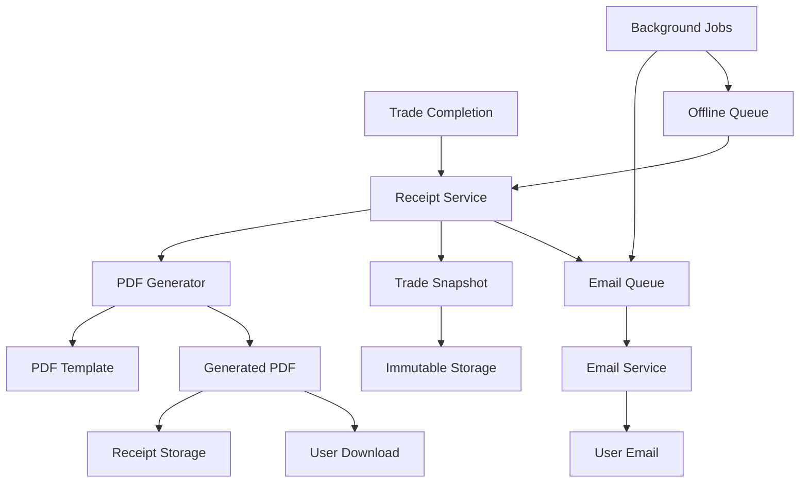

# Design Document

## Overview

The PDF Receipt Generation system provides professional, audit-compliant trade receipts for completed trades. The system uses PDFKit for client-side PDF generation, implements immutable trade snapshots for audit compliance, and provides both immediate and queued receipt delivery with email integration.

## Architecture

### High-Level Architecture



### System Components

1. **Receipt Service**: Orchestrates receipt generation workflow
2. **PDF Generator**: Creates professional PDF documents using PDFKit
3. **Trade Snapshot Service**: Creates immutable trade records
4. **Email Queue**: Manages email delivery with retry logic
5. **Receipt Storage**: Stores and manages receipt files
6. **Offline Queue**: Handles receipt requests during poor connectivity

## Components and Interfaces

### Receipt Service

**Purpose**: Central orchestrator for receipt generation workflow

**Key Methods**:
- `generateReceipt(tradeId: string): Promise<ReceiptResult>`
- `queueReceiptGeneration(tradeId: string): Promise<QueueResult>`
- `processQueuedReceipts(): Promise<ProcessResult[]>`
- `getReceiptHistory(userId: string): Promise<Receipt[]>`

**Dependencies**: PDF Generator, Trade Snapshot Service, Email Queue, Receipt Storage

### PDF Generator

**Purpose**: Creates professional PDF documents with trade details

**Key Methods**:
- `createTradePDF(tradeSnapshot: TradeSnapshot): Promise<Buffer>`
- `generateReceiptTemplate(data: ReceiptData): PDFDocument`
- `addTradeDetails(doc: PDFDocument, trade: TradeSnapshot): void`
- `addPricingSection(doc: PDFDocument, pricing: PricingData): void`

**Technology**: PDFKit library for client-side PDF generation

### Trade Snapshot Service

**Purpose**: Creates immutable, tamper-proof trade records

**Key Methods**:
- `createTradeSnapshot(tradeId: string): Promise<TradeSnapshot>`
- `verifySnapshotIntegrity(snapshot: TradeSnapshot): boolean`
- `getSnapshotById(snapshotId: string): Promise<TradeSnapshot>`

**Features**:
- Cryptographic hash verification
- Complete pricing version capture
- Manual override tracking
- Participant consent recording

### Email Queue Service

**Purpose**: Manages reliable email delivery with retry logic

**Key Methods**:
- `queueReceiptEmail(recipients: string[], pdfBuffer: Buffer, tradeData: TradeData): Promise<void>`
- `processEmailQueue(): Promise<EmailResult[]>`
- `retryFailedEmails(): Promise<RetryResult[]>`

**Features**:
- Exponential backoff retry (3 attempts)
- User consent verification
- Unsubscribe link generation
- Privacy-compliant email content

## Data Models

### TradeSnapshot

```typescript
interface TradeSnapshot {
  id: string
  tradeId: string
  sessionId: string
  
  // Participants
  proposerId: string
  recipientId: string
  proposerName: string
  recipientName: string
  
  // Trade Items
  proposerItems: TradeItem[]
  recipientItems: TradeItem[]
  
  // Pricing Information
  proposerTotalValue: number
  recipientTotalValue: number
  fairnessPercentage: number
  priceVersion: string
  priceTimestamp: string
  priceSource: 'tcgplayer_market' | 'buylist'
  
  // Manual Overrides
  manualOverrides: ManualOverride[]
  fairnessAdjustments: FairnessAdjustment[]
  
  // Metadata
  completedAt: string
  snapshotHash: string
  integrityVerified: boolean
  
  // Audit Trail
  createdAt: string
  createdBy: string
}
```

### Receipt

```typescript
interface Receipt {
  id: string
  tradeSnapshotId: string
  userId: string
  
  // PDF Details
  pdfUrl: string
  pdfSize: number
  generatedAt: string
  
  // Email Details
  emailSent: boolean
  emailSentAt?: string
  emailRetries: number
  
  // Status
  status: 'generating' | 'ready' | 'failed' | 'queued'
  errorMessage?: string
  
  // Metadata
  createdAt: string
  expiresAt: string
}
```

### ReceiptQueue

```typescript
interface ReceiptQueue {
  id: string
  tradeId: string
  userId: string
  priority: 'normal' | 'high'
  
  // Queue Status
  status: 'pending' | 'processing' | 'completed' | 'failed'
  attempts: number
  maxAttempts: number
  
  // Timing
  scheduledAt: string
  processedAt?: string
  nextRetryAt?: string
  
  // Error Handling
  lastError?: string
  errorCount: number
  
  // Metadata
  createdAt: string
  expiresAt: string
}
```

Now I need to use the prework tool to analyze the acceptance criteria before writing the correctness properties:

<function_calls>
<invoke name="prework">
<parameter name="featureName">pdf-receipt-generation

## Correctness Properties

*A property is a characteristic or behavior that should hold true across all valid executions of a system-essentially, a formal statement about what the system should do. Properties serve as the bridge between human-readable specifications and machine-verifiable correctness guarantees.*

### Property Reflection

After analyzing all acceptance criteria, I identified several areas where properties can be consolidated:

- **PDF Content Properties**: Multiple criteria test that different types of information are included in PDFs. These can be combined into comprehensive content validation properties.
- **Performance Properties**: Both generation time and concurrent handling can be tested together as system performance properties.
- **Email Delivery Properties**: Consent, retry logic, and content can be combined into comprehensive email delivery properties.
- **Queue Processing Properties**: Order, deduplication, and processing can be combined into queue behavior properties.
- **Security Properties**: Encryption, access control, and audit logging can be combined into comprehensive security properties.

### Core Properties

**Property 1: PDF Content Completeness**
*For any* completed trade, the generated PDF should contain all required information: participant details, complete item lists with conditions/languages/finishes, pricing information with versions and timestamps, fairness calculations, manual overrides, unique trade ID, completion timestamp, and session information
**Validates: Requirements 1.2, 1.3, 1.4, 1.5**

**Property 2: PDF Generation Performance**
*For any* trade completion request, PDF generation should complete within 2 seconds (P95) and handle concurrent generation requests without failure
**Validates: Requirements 6.1, 6.2**

**Property 3: Trade Snapshot Immutability**
*For any* created trade snapshot, the record should be immutable (modification attempts fail), contain complete pricing and override data, include cryptographic integrity verification, and remain permanently accessible
**Validates: Requirements 2.1, 2.2, 2.3, 2.4, 2.5**

**Property 4: Email Delivery with Consent**
*For any* receipt generation, emails should only be sent to participants with explicit consent, include trade summary and PDF attachment, implement retry logic (3 attempts with exponential backoff), and include unsubscribe options
**Validates: Requirements 3.1, 3.2, 3.3, 3.4, 3.5**

**Property 5: Offline Queue Processing**
*For any* receipt request during poor connectivity, the request should be queued, processed in FIFO order when connectivity returns, prevent duplicate generation, notify users of completion, and expire after 7 days
**Validates: Requirements 4.1, 4.2, 4.3, 4.4, 4.5**

**Property 6: Receipt Storage and Access**
*For any* generated receipt, it should be stored permanently, accessible only by authorized users (participants), downloadable in original PDF format, searchable by trade details, and maintained for minimum 2 years
**Validates: Requirements 5.1, 5.2, 5.3, 5.4, 5.5**

**Property 7: Professional Template Consistency**
*For any* generated PDF, it should use consistent professional formatting, include TradeEqualizer branding and legal disclaimers, organize information in logical sections (participants, items, pricing, summary), and format dates/currencies consistently
**Validates: Requirements 7.1, 7.2, 7.3, 7.4, 7.5**

**Property 8: Security and Privacy Compliance**
*For any* receipt data, it should be encrypted in storage and transmission, implement proper access controls, use secure email protocols, create audit logs without PII exposure, and comply with data retention policies
**Validates: Requirements 8.1, 8.2, 8.3, 8.4, 8.5**

**Property 9: Error Handling and Recovery**
*For any* PDF generation failure, the system should retry automatically, provide user notifications, maintain progress indicators during generation, and optimize for mobile network conditions
**Validates: Requirements 6.3, 6.4, 6.5**

## Error Handling

### PDF Generation Errors

**Scenarios**:
- Template rendering failures
- Data serialization errors
- Memory constraints on large trades
- Network timeouts during generation

**Handling Strategy**:
- Automatic retry with exponential backoff (3 attempts)
- Fallback to simplified template for memory issues
- User notification with error details
- Queue for retry during network issues

### Email Delivery Errors

**Scenarios**:
- SMTP server unavailable
- Invalid email addresses
- Attachment size limits
- User consent revoked

**Handling Strategy**:
- Retry queue with exponential backoff
- Email validation before sending
- PDF compression for size limits
- Consent verification before each send

### Storage and Retrieval Errors

**Scenarios**:
- Database connection failures
- File storage unavailable
- Corrupted PDF files
- Access permission errors

**Handling Strategy**:
- Database connection pooling and retry
- Multiple storage backend support
- Integrity verification and re-generation
- Proper error logging and user feedback

## Testing Strategy

### Dual Testing Approach

The system will use both unit tests and property-based tests for comprehensive coverage:

**Unit Tests** will focus on:
- Specific PDF template rendering scenarios
- Email delivery edge cases (invalid addresses, size limits)
- Database error conditions and recovery
- Integration points between components

**Property-Based Tests** will focus on:
- Universal properties across all trade types and sizes
- Comprehensive input coverage through randomization
- Performance characteristics under various loads
- Security and privacy compliance across all scenarios

### Property-Based Testing Configuration

- **Testing Framework**: fast-check for TypeScript property-based testing
- **Test Iterations**: Minimum 100 iterations per property test
- **Test Tagging**: Each property test references its design document property
- **Tag Format**: **Feature: pdf-receipt-generation, Property {number}: {property_text}**

### Performance Testing

**PDF Generation Performance**:
- Test with trades of varying complexity (1-100 items)
- Measure P95 generation times including cold starts
- Verify concurrent generation handling (10+ simultaneous)
- Test mobile network simulation with bandwidth limits

**Email Queue Performance**:
- Test queue processing with 100+ queued emails
- Verify retry logic timing and exponential backoff
- Test email delivery under various failure scenarios

**Storage Performance**:
- Test receipt retrieval with large user histories (1000+ receipts)
- Verify search performance across receipt metadata
- Test concurrent access patterns

### Security Testing

**Access Control Testing**:
- Verify users can only access their own receipts
- Test unauthorized access attempts return proper errors
- Verify admin access controls for audit functions

**Data Protection Testing**:
- Verify encryption at rest and in transit
- Test PII protection in logs and audit trails
- Verify secure email transmission protocols

**Integrity Testing**:
- Test cryptographic hash verification for trade snapshots
- Verify tamper detection for modified snapshots
- Test integrity verification performance impact